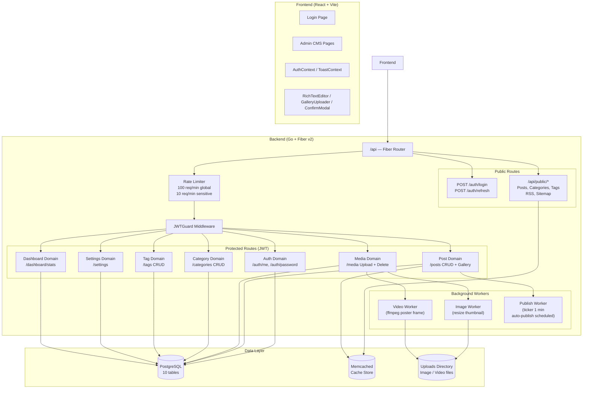
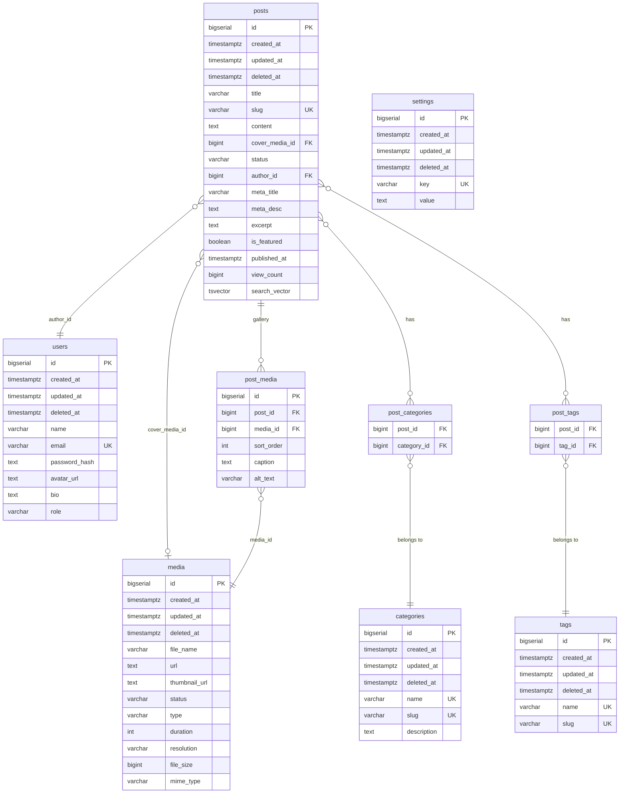
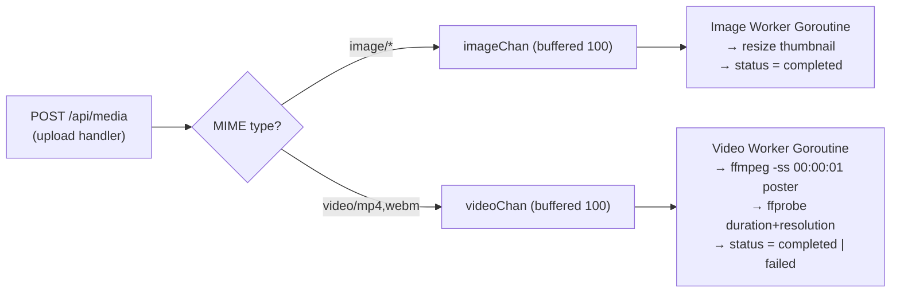

# Blog Engine — Tài Liệu Tổng Hợp 6 Phase Phát Triển

> **Phiên bản**: 1.0.0  
> **Ngày hoàn thành**: 2026-07-13  
> **Tình trạng kiểm thử**: ✅ Backend `go test ./...` PASS | ✅ `go build ./...` PASS | ✅ Frontend `npm run build` PASS

---

## 1. Tổng Quan Dự Án

Blog Engine là một hệ thống CMS (Content Management System) hoàn chỉnh gồm hai phần:

- **Admin CMS** — giao diện quản lý nội dung cho quản trị viên và biên tập viên.
- **Public Reader API** — API phục vụ độc giả, không cần xác thực.

### Stack Công Nghệ

| Lớp | Công nghệ |
|---|---|
| **Backend Language** | Go 1.25 |
| **HTTP Framework** | Fiber v2 |
| **ORM** | GORM v1.31 |
| **Database** | PostgreSQL |
| **Cache** | Memcached (`bradfitz/gomemcache`) |
| **Authentication** | JWT HS256 (`golang-jwt/jwt/v5`) + bcrypt (cost 12) |
| **Migrations** | `golang-migrate/migrate/v4` |
| **Validation** | `go-playground/validator/v10` |
| **Media Processing** | FFmpeg (video thumbnail) + FFprobe (metadata) |
| **Frontend** | React 18 + Vite + TypeScript |
| **Styling** | TailwindCSS (dark glassmorphism theme) |
| **Rich Text Editor** | TipTap (`@tiptap/react`) |
| **Charts** | Recharts |
| **HTTP Client** | Axios |
| **Form Library** | React Hook Form + Zod |
| **Testing (Go)** | `testing` package + SQLite in-memory (`glebarez/sqlite`) |

---

## 2. Kiến Trúc Tổng Thể



---

## 3. Sơ Đồ Cơ Sở Dữ Liệu (ERD)



---

## 4. Danh Sách API Routes Đầy Đủ

### 🔓 Public Routes (Không cần JWT)

| Method | Path | Mô tả |
|--------|------|--------|
| `POST` | `/api/auth/login` | Đăng nhập (Rate limit: 10/min) |
| `POST` | `/api/auth/refresh` | Làm mới access token từ refresh cookie |
| `GET` | `/api/settings` | Đọc cấu hình hệ thống |
| `GET` | `/api/public/posts` | Danh sách bài đã published (search, filter, page) |
| `GET` | `/api/public/posts/:slug` | Chi tiết bài viết theo slug (tăng view_count) |
| `GET` | `/api/public/categories` | Danh sách tất cả categories |
| `GET` | `/api/public/tags` | Danh sách tất cả tags |
| `GET` | `/api/public/feed.xml` | RSS 2.0 XML Feed (20 bài mới nhất) |
| `GET` | `/api/public/sitemap.xml` | Sitemap XML (tất cả bài published) |

### 🔐 Protected Routes (Yêu cầu JWT Bearer Token)

#### Auth & Profile
| Method | Path | Mô tả |
|--------|------|--------|
| `POST` | `/api/auth/logout` | Đăng xuất (xóa cookie) |
| `GET` | `/api/auth/me` | Lấy thông tin người dùng hiện tại |
| `PUT` | `/api/auth/me` | Cập nhật profile (name, avatar_url, bio) |
| `PUT` | `/api/auth/password` | Đổi mật khẩu (verify mật khẩu cũ trước) |

#### Dashboard & Settings
| Method | Path | Mô tả |
|--------|------|--------|
| `GET` | `/api/dashboard/stats` | Thống kê tổng hợp (counts, chart, storage) |
| `PUT` | `/api/settings` | Cập nhật cấu hình hệ thống |

#### Categories
| Method | Path | Mô tả |
|--------|------|--------|
| `GET` | `/api/categories` | Danh sách categories |
| `POST` | `/api/categories` | Tạo category mới |
| `PUT` | `/api/categories/:id` | Cập nhật category |
| `DELETE` | `/api/categories/:id` | Xóa category |

#### Tags
| Method | Path | Mô tả |
|--------|------|--------|
| `GET` | `/api/tags` | Danh sách tags |
| `POST` | `/api/tags` | Tạo tag mới |
| `DELETE` | `/api/tags/:id` | Xóa tag |

#### Media
| Method | Path | Mô tả |
|--------|------|--------|
| `POST` | `/api/media` | Upload file (Rate limit: 10/min) |
| `GET` | `/api/media` | Danh sách media (phân trang) |
| `GET` | `/api/media/:id` | Chi tiết media |
| `DELETE` | `/api/media/:id` | Xóa media (từ chối nếu đang dùng: 409) |

#### Posts
| Method | Path | Mô tả |
|--------|------|--------|
| `POST` | `/api/posts` | Tạo bài viết mới |
| `PUT` | `/api/posts/:id` | Cập nhật bài viết |
| `DELETE` | `/api/posts/:id` | Xóa bài viết |
| `GET` | `/api/posts` | Danh sách bài viết (search, filter, page) |
| `GET` | `/api/posts/:id` | Chi tiết bài viết |
| `POST` | `/api/posts/:id/media` | Thêm media vào gallery bài viết |
| `DELETE` | `/api/posts/:id/media/:mediaId` | Gỡ media khỏi gallery |
| `PUT` | `/api/posts/:id/media/reorder` | Sắp xếp lại thứ tự gallery |
| `GET` | `/api/posts/:id/media` | Lấy danh sách gallery |
| `GET` | `/api/health` | Health check endpoint |

---

## 5. Chi Tiết Từng Phase

---

### Phase 1 — Auth, JWT & Author Integration

**Mục tiêu**: Xây dựng hệ thống xác thực an toàn với JWT, tích hợp Author vào bài viết, seed tài khoản admin mặc định.

#### Files tạo mới (Backend)

| File | Mô tả |
|------|--------|
| `migrations/000001_create_users.up.sql` | Tạo bảng `users` với các cột chuẩn |
| `migrations/000002_create_media.up.sql` | Tạo bảng `media` cơ bản |
| `migrations/000003_create_posts.up.sql` | Tạo bảng `posts` với foreign key đến users và media |
| `internal/auth/models/user.go` | GORM model User |
| `internal/auth/repository/user_repository.go` | Repository với `FindByEmail` |
| `internal/auth/service/auth_service.go` | Login, RefreshToken, JWT generation, bcrypt |
| `internal/auth/handlers/auth_handler.go` | HTTP handlers: Login, Refresh, Logout, Me, UpdateProfile, ChangePassword |
| `internal/shared/middleware/auth_middleware.go` | JWTGuard middleware inject `user_id` vào `c.Locals` |
| `internal/seeds/seeder.go` | Interface `Seeder` và orchestrator `Run()` |
| `internal/seeds/user_seeder.go` | Seed 2 tài khoản: admin + editor |
| `internal/seeds/post_seeder.go` | Seed 7 bài viết mẫu kỹ thuật chi tiết |
| `cmd/migrate/main.go` | CLI quản lý SQL migrations |
| `cmd/seed/main.go` | CLI chạy database seeder |
| `Makefile` | Automation: migrate-up/down, db-seed, build, run |
| `scripts/migrate.ps1` | PowerShell equivalent cho Windows |

#### Files tạo mới (Frontend)

| File | Mô tả |
|------|--------|
| `web/src/context/AuthContext.tsx` | AuthProvider, useAuth hook, session persistence |
| `web/src/pages/Login.tsx` | Trang đăng nhập glassmorphism premium |
| `web/src/components/ProtectedRoute.tsx` | Route guard dùng Outlet pattern |

#### Files chỉnh sửa

| File | Thay đổi |
|------|----------|
| `pkg/config/config.go` | Thêm trường `JWTSecret` |
| `internal/post/models/post.go` | Thêm `AuthorID` và `Author` (belongs-to) |
| `internal/post/commands/service.go` | Set `AuthorID` từ JWT context |
| `internal/post/handlers/post_handler.go` | Inject `user_id` từ `c.Locals` |
| `internal/post/repository/post_repository.go` | Thêm `Preload("Author")` |
| `bootstrap/app.go` | Wire auth domain, JWTGuard, protected routes |
| `web/src/router/index.tsx` | Thêm `/login` route, bọc ProtectedRoute |
| `web/src/main.tsx` | Bọc `<AuthProvider>` |
| `web/src/layouts/AdminLayout.tsx` | Hiển thị user info thực, nút Logout |
| `web/src/pages/PostList.tsx` | Thêm cột Author |

#### Thiết kế JWT

```go
// Claims - payload JWT
type Claims struct {
    UserID uint   `json:"user_id"`
    Role   string `json:"role"`
    jwt.RegisteredClaims
}

// Access token: 15 phút
// Refresh token: 7 ngày (HttpOnly cookie, SameSite=Lax)
```

#### Thông tin tài khoản mặc định

| Email | Password | Role |
|-------|----------|------|
| `admin@example.com` | `Admin@123` | admin |
| `editor@example.com` | `Editor@123` | editor |

> [!NOTE]
> Seeder kiểm tra idempotency: chỉ tạo user nếu email chưa tồn tại trong DB (kể cả đã soft-delete).

---

### Phase 2 — Category, Tag & TipTap Rich Text Editor

**Mục tiêu**: Xây dựng hệ thống phân loại nội dung (Category, Tag), quan hệ Many-To-Many với Post, tích hợp trình soạn thảo TipTap.

#### Migrations

| File | Nội dung |
|------|----------|
| `000004_create_categories.up.sql` | Bảng `categories` (`name` unique, `slug` unique, `description`) |
| `000005_create_tags.up.sql` | Bảng `tags` (`name` unique, `slug` unique) |
| `000006_create_post_relations.up.sql` | Bảng `post_categories` và `post_tags` (composite PK, CASCADE DELETE) |

#### Files tạo mới (Backend)

| File | Mô tả |
|------|--------|
| `internal/category/models/category.go` | GORM model Category |
| `internal/category/repository/category_repository.go` | Repository + `FindBySlug` |
| `internal/category/handlers/category_handler.go` | CRUD handlers (auto-generate slug) |
| `internal/tag/models/tag.go` | GORM model Tag |
| `internal/tag/repository/tag_repository.go` | Repository + `FindBySlug` |
| `internal/tag/handlers/tag_handler.go` | List, Create, Delete handlers |

#### Files tạo mới (Frontend)

| File | Mô tả |
|------|--------|
| `web/src/pages/Categories.tsx` | CRUD UI hai cột: danh sách + form |
| `web/src/pages/Tags.tsx` | Tag manager dạng dismissible chips |
| `web/src/components/RichTextEditor.tsx` | TipTap editor với toolbar và Media Picker inline |

#### Cập nhật Post Model (Many-To-Many)

```go
type Post struct {
    // ...
    Categories []categoryModels.Category `gorm:"many2many:post_categories;" json:"categories,omitempty"`
    Tags       []tagModels.Tag           `gorm:"many2many:post_tags;" json:"tags,omitempty"`
}
```

#### Cập nhật Command (Association Replace)

```go
// Trong UpdatePost — thay thế toàn bộ associations
var categories []categoryModels.Category
db.Where("id IN ?", cmd.CategoryIDs).Find(&categories)
db.Model(&post).Association("Categories").Replace(&categories)
```

#### TipTap Extensions được cấu hình

- `@tiptap/starter-kit` (H1/H2/H3, Bold, Italic, Lists, Blockquote, HRule)
- `@tiptap/extension-link` (Link insertion với popover modal)
- `@tiptap/extension-image` (Insert image từ Media Library popup)

---

### Phase 3 — Media Gallery & Video Processing

**Mục tiêu**: Nâng cấp hệ thống media hỗ trợ video, gallery cho bài viết, xử lý thumbnail bất đồng bộ, và xóa media an toàn.

#### Migrations

| File | Nội dung |
|------|----------|
| `000007_add_media_fields.up.sql` | Thêm cột `type`, `duration`, `resolution`, `file_size`, `mime_type` vào bảng `media` |
| `000008_create_post_media.up.sql` | Tạo bảng `post_media` (gallery association với `sort_order`, `caption`, `alt_text`) |

#### Files tạo mới (Backend)

| File | Mô tả |
|------|--------|
| `internal/post/models/post_media.go` | Model `PostMedia` (gallery item) |

#### Cập nhật Media Model

```go
type Media struct {
    models.BaseModel
    FileName     string `gorm:"type:varchar(255);not null" json:"file_name"`
    URL          string `gorm:"type:text;not null" json:"url"`
    ThumbnailURL string `gorm:"type:text" json:"thumbnail_url,omitempty"`
    Status       string `gorm:"type:varchar(50);not null;default:'processing'" json:"status"`
    Type         string `gorm:"type:varchar(20);not null;default:'image'" json:"type"` // image | video
    Duration     int    `json:"duration,omitempty"` // seconds
    Resolution   string `gorm:"type:varchar(50)" json:"resolution,omitempty"` // "1920x1080"
    FileSize     int64  `json:"file_size"`
    MimeType     string `gorm:"type:varchar(100)" json:"mime_type"`
}
```

#### Dual Worker Architecture



#### Media Delete — Reference Safety Logic

```go
// DELETE /api/media/:id — logic kiểm tra an toàn
var postCount int64
db.Model(&postModels.Post{}).Where("cover_media_id = ?", id).Count(&postCount)

var galleryCount int64
db.Model(&postModels.PostMedia{}).Where("media_id = ?", id).Count(&galleryCount)

if postCount > 0 || galleryCount > 0 {
    return c.Status(409).JSON(fiber.Map{
        "success": false,
        "message": "Media đang được sử dụng",
    })
}
// Else: xóa file vật lý + soft delete DB
os.Remove(filePath)
os.Remove(thumbnailPath)
db.Delete(&media)
```

#### Giới hạn Upload

| Loại | MIME Types | Giới hạn |
|------|-----------|---------|
| Image | `image/*` | 10 MB |
| Video | `video/mp4`, `video/webm` | 500 MB |

#### Files tạo mới (Frontend)

| File | Mô tả |
|------|--------|
| `web/src/components/GalleryUploader.tsx` | Grid quản lý gallery: Drag & Drop sort, inline caption/alt, Media Picker popup |

---

### Phase 4 — SEO, Full-Text Search & Public API

**Mục tiêu**: Thêm các trường SEO cho bài viết, triển khai Full-Text Search trong PostgreSQL, tách biệt API public cho độc giả, tự động publish bài viết hẹn giờ.

#### Migrations

| File | Nội dung |
|------|----------|
| `000009_add_post_seo_and_publish_fields.up.sql` | Thêm `meta_title`, `meta_desc`, `excerpt`, `is_featured`, `published_at`, `view_count`, `search_vector` vào `posts`. Tạo GIN index và DB trigger tự động cập nhật `search_vector`. |

#### Trigger PostgreSQL cho Full-Text Search

```sql
CREATE OR REPLACE FUNCTION posts_search_vector_trigger() RETURNS trigger AS $$
begin
  new.search_vector :=
    to_tsvector('english', coalesce(new.title, '')) ||
    to_tsvector('english', coalesce(new.content, ''));
  return new;
end
$$ LANGUAGE plpgsql;

CREATE TRIGGER trigger_posts_search_vector
  BEFORE INSERT OR UPDATE ON posts
  FOR EACH ROW EXECUTE FUNCTION posts_search_vector_trigger();

CREATE INDEX idx_posts_search_vector ON posts USING gin(search_vector);
```

#### Scheduled Publish Worker

```go
// Chạy mỗi 1 phút, tự động publish bài viết hẹn giờ
ticker := time.NewTicker(1 * time.Minute)
for {
    select {
    case <-ticker.C:
        result := db.Model(&models.Post{}).
            Where("status = 'draft' AND published_at <= NOW()").
            UpdateColumn("status", "published")
        if result.RowsAffected > 0 {
            cacheStore.Increment(ctx, "posts:version", 1) // invalidate list cache
        }
    case <-ctx.Done():
        return
    }
}
```

#### Full-Text Search Query

```go
// Tìm kiếm toàn văn theo PostgreSQL tsvector
db.Where("search_vector @@ plainto_tsquery('english', ?)", searchTerm)
```

#### Files tạo mới (Backend)

| File | Mô tả |
|------|--------|
| `internal/public/handlers/public_handler.go` | ListPosts, GetPostBySlug, ListCategories, ListTags, GetRSSFeed, GetSitemap |
| `internal/post/worker/publish_worker.go` | Scheduled publish goroutine |

#### Public API — Cache Strategy

- Cache namespace riêng: `public:posts:v{version}:...`
- TTL: 10 phút cho list, 15 phút cho detail
- View count tăng bất đồng bộ (non-blocking goroutine)

#### Frontend Updates

| Tính năng | Mô tả |
|-----------|--------|
| Google Search Preview | Widget giả lập kết quả tìm kiếm Google theo realtime |
| SEO Panel | Nhập Meta Title (60 char), Meta Description (160 char) với counter |
| Scheduled Publish | `datetime-local` input cho `published_at` |
| Featured Toggle | Switch bật/tắt featured |
| Debounced Search | Debounce 400ms, tự động gọi lại API khi ngừng gõ |
| Category/Tag Filter | Dropdown filter trong PostList |

---

### Phase 5 — Dashboard, Settings & Toast System

**Mục tiêu**: Xây dựng trang Dashboard trực quan với biểu đồ Recharts, trang cài đặt hệ thống, và hệ thống thông báo Toast thay thế cho browser `alert()`.

#### Migrations

| File | Nội dung |
|------|----------|
| `000010_create_settings.up.sql` | Tạo bảng `settings` key-value. Seed mặc định: `site_name`, `site_description`, `logo_url`. |

#### Dashboard Stats API Response

```json
{
  "total_posts": 7,
  "published_posts": 5,
  "draft_posts": 2,
  "media_count": 12,
  "category_count": 4,
  "tag_count": 8,
  "posts_by_month": [
    { "month": "Jan", "count": 0 },
    { "month": "Jul", "count": 7 }
  ],
  "recent_posts": [...],
  "storage_usage_mb": 45.2
}
```

#### Storage Calculation

```go
// Tính dung lượng thư mục uploads đệ quy
filepath.Walk(uploadsDir, func(path string, info os.FileInfo, err error) error {
    if !info.IsDir() {
        totalBytes += info.Size()
    }
    return nil
})
storageMB := float64(totalBytes) / (1024 * 1024)
```

#### Files tạo mới (Backend)

| File | Mô tả |
|------|--------|
| `internal/settings/models/settings.go` | GORM model Setting |
| `internal/settings/repository/settings_repository.go` | GetAll, UpdateMany |
| `internal/settings/handlers/settings_handler.go` | GetSettings, UpdateSettings |
| `internal/dashboard/handlers/dashboard_handler.go` | GetStats handler |

#### Files tạo mới (Frontend)

| File | Mô tả |
|------|--------|
| `web/src/context/ToastContext.tsx` | ToastProvider, useToast hook, floating notification UI |
| `web/src/pages/Settings.tsx` | 3 tabs: Site Config, Profile Info, Change Password |
| `web/src/components/ConfirmModal.tsx` | Custom modal thay thế `window.confirm()` |

#### Toast System API

```tsx
const { showSuccess, showError, showWarning } = useToast();

// Sử dụng
showSuccess("Bài viết đã được lưu thành công!");
showError("Đã xảy ra lỗi khi upload file.");
showWarning("Kết nối không ổn định.");
```

#### Settings Page Tabs

| Tab | Trường |
|-----|--------|
| **Site Config** | Site Name, Site Description, Logo URL/Upload |
| **Profile Info** | Name, Avatar URL/Upload, Bio |
| **Change Password** | Old Password, New Password, Confirm Password |

#### Frontend Environment Variables

```bash
# web/.env
VITE_API_BASE_URL=http://localhost:8080/api
```

---

### Phase 6 — Hardening, Feeds, Rate Limiting & Tests

**Mục tiêu**: Production hardening — graceful shutdown, request validation, rate limiting, structured JSON logging, RSS/Sitemap feeds, và unit test coverage.

#### Graceful Shutdown

```go
// cmd/api/main.go
ctx, stop := signal.NotifyContext(context.Background(), syscall.SIGINT, syscall.SIGTERM)
defer stop()

app, cleanup, err := bootstrap.New(ctx)
defer cleanup() // đóng DB khi thoát

go func() {
    <-ctx.Done()
    _ = app.Shutdown() // chờ request hiện tại hoàn thành
}()

app.Listen(":8080")
```

#### Rate Limiting Configuration

| Scope | Limit | Endpoints |
|-------|-------|-----------|
| Global | 100 req/min/IP | Tất cả routes |
| Sensitive | 10 req/min/IP | `POST /auth/login`, `POST /media` |

#### Request Validation

```go
// Sử dụng go-playground/validator/v10
type LoginRequest struct {
    Email    string `json:"email" validate:"required,email"`
    Password string `json:"password" validate:"required,min=6"`
}

// Shared validator helper
func Validate(payload interface{}) error {
    validate := validator.New()
    if err := validate.Struct(payload); err != nil {
        // Trả về structured errors
    }
    return nil
}
```

#### Structured JSON Logger

```go
// LOG_FORMAT=json → xuất JSON logs
{
  "time": "2026-07-13T13:00:00+07:00",
  "level": "info",
  "msg": "Connected to PostgreSQL successfully."
}

// LOG_FORMAT= (mặc định) → plain text logs
INFO: 2026/07/13 13:00:00 logger.go:36: Connected to PostgreSQL successfully.
```

#### RSS 2.0 Feed (GET /api/public/feed.xml)

```xml
<?xml version="1.0" encoding="UTF-8"?>
<rss version="2.0">
  <channel>
    <title>Blog Engine</title>
    <link>https://yourblog.com</link>
    <description>Welcome to my tech blog</description>
    <item>
      <title>Building a REST API with Go Fiber v2</title>
      <link>https://yourblog.com/posts/building-rest-api-go-fiber-v2</link>
      <pubDate>Sun, 13 Jul 2026 06:00:00 +0000</pubDate>
      <description>Learn Fiber v2, GORM, and PostgreSQL...</description>
    </item>
    <!-- top 20 bài mới nhất -->
  </channel>
</rss>
```

#### Sitemap.xml (GET /api/public/sitemap.xml)

```xml
<?xml version="1.0" encoding="UTF-8"?>
<urlset xmlns="http://www.sitemaps.org/schemas/sitemap/0.9">
  <url><loc>https://yourblog.com</loc></url>
  <url><loc>https://yourblog.com/posts/building-rest-api-go-fiber-v2</loc></url>
  <!-- ... tất cả bài published -->
</urlset>
```

#### Unit Tests Coverage

| Test File | Cases | Test Driver |
|-----------|-------|-------------|
| `internal/auth/service/auth_service_test.go` | Hash password, Login success/fail, Token validate | SQLite in-memory |
| `internal/post/commands/service_test.go` | CreatePost, UpdatePost, associations | SQLite in-memory |
| `internal/post/queries/service_test.go` | GetByID, ListPosts, pagination, filter | SQLite in-memory |

```bash
go test -v ./...
# OK  backend/internal/auth/service    1.749s
# OK  backend/internal/post/commands   0.823s
# OK  backend/internal/post/queries    0.654s
```

---

### Hotfix — Bug GORM Column Mapping Sai

**Phát hiện**: 2026-07-13

**Triệu chứng**: API `/api/auth/login` luôn trả về `"invalid email or password"` dù đã nhập đúng mật khẩu `Admin@123`.

**Nguyên nhân gốc**: Struct tag của trường `PasswordHash` trong `internal/auth/models/user.go` bị khai báo sai tên cột:

```go
// ❌ SAI — GORM tìm cột tên "password" nhưng migration tạo cột "password_hash"
PasswordHash string `gorm:"column:password;type:text;not null" json:"-"`

// ❌ SAI — Bio bị ẩn dù migration có cột "bio"
Bio string `gorm:"-" json:"bio,omitempty"`
```

**Hệ quả**: GORM query `SELECT * FROM users` trả về giá trị rỗng (`""`) cho `PasswordHash` vì cột `password` không tồn tại. `bcrypt.CompareHashAndPassword([]byte(""), ...)` luôn fail.

**Fix đã áp dụng**:

```go
// ✅ ĐÚNG
PasswordHash string `gorm:"column:password_hash;type:text;not null" json:"-"`
Bio          string `gorm:"type:text" json:"bio,omitempty"`
```

**Kết quả sau fix**:
```
ID: 1 | Email: admin@example.com
  PasswordHash: $2a$12$k2yq9E/nCI5...  (len: 60)
  Matches 'Admin@123': YES ✅
```

---

## 6. Hướng Dẫn Vận Hành

### Yêu cầu hệ thống

| Công cụ | Phiên bản tối thiểu |
|---------|---------------------|
| Go | 1.25+ |
| Node.js | 18+ |
| PostgreSQL | 14+ |
| Memcached | 1.6+ |
| FFmpeg + FFprobe | Bất kỳ (tùy chọn, dùng cho video) |

### Cấu hình môi trường

```bash
# C:\laragon\www\blogs\.env
DB_HOST=localhost
DB_PORT=5432
DB_USER=root
DB_PASSWORD=
DB_NAME=blogs
DB_SSLMODE=disable

MEMCACHED_ADDR=localhost:11211
JWT_SECRET=blog-engine-super-secret-jwt-key-2026

UPLOADS_DIR=./uploads
AUTO_MIGRATE=false  # Dùng SQL migrations thay vì AutoMigrate

LOG_FORMAT=         # Để trống = plain text, "json" = JSON structured
```

```bash
# C:\laragon\www\blogs\web\.env
VITE_API_BASE_URL=http://localhost:8080/api
```

### Khởi tạo lần đầu

```bash
# 1. Cài đặt Go dependencies
cd C:\laragon\www\blogs\backend
go mod tidy

# 2. Cài đặt Node dependencies
cd C:\laragon\www\blogs\web
npm install

# 3. Apply tất cả database migrations (version 1 → 10)
cd C:\laragon\www\blogs\backend
.\scripts\migrate.ps1 up      # Windows PowerShell
# hoặc:
make migrate-up               # Git Bash / WSL

# 4. Nạp dữ liệu mẫu
.\scripts\migrate.ps1 seed
# hoặc:
make db-seed

# 5. Khởi động dự án
cd C:\laragon\www\blogs
.\start.bat
```

### Lệnh Makefile tham khảo

```bash
make migrate-up              # Apply tất cả pending migrations
make migrate-down            # Rollback 1 migration
make migrate-down STEPS=3    # Rollback 3 migrations
make migrate-status          # Xem version hiện tại
make migrate-create N=name   # Tạo cặp file migration mới
make db-seed                 # Nạp dữ liệu mẫu
make build                   # Build binary cms.exe
make run                     # Chạy dev server
```

### Chạy Unit Tests

```bash
cd C:\laragon\www\blogs\backend
go test -v ./...
```

### Truy cập sau khi khởi động

| Endpoint | URL |
|----------|-----|
| Admin CMS | http://localhost:5173 |
| Backend API | http://localhost:8080/api |
| RSS Feed | http://localhost:8080/api/public/feed.xml |
| Sitemap | http://localhost:8080/api/public/sitemap.xml |

### Thông tin đăng nhập

| Tài khoản | Email | Mật khẩu |
|-----------|-------|----------|
| Admin | `admin@example.com` | `Admin@123` |
| Editor | `editor@example.com` | `Editor@123` |

---

## 7. Cấu Trúc Thư Mục Dự Án

```
blogs/
├── .env                          # Cấu hình môi trường
├── start.bat                     # Khởi động cả backend và frontend
├── blog_engine_phases.md         # Tài liệu này
│
├── backend/                      # Go API Server
│   ├── cmd/
│   │   ├── api/main.go           # Entrypoint — Graceful Shutdown
│   │   ├── migrate/main.go       # CLI — Database Migrations
│   │   └── seed/main.go          # CLI — Database Seeder
│   ├── migrations/               # 10 cặp file SQL (up/down)
│   ├── bootstrap/app.go          # DI wiring, Fiber config, route registration
│   ├── internal/
│   │   ├── auth/                 # Authentication domain
│   │   ├── category/             # Category CRUD domain
│   │   ├── tag/                  # Tag CRUD domain
│   │   ├── media/                # Media Upload + Worker domain
│   │   ├── post/                 # Post CRUD + Gallery + Worker domain
│   │   ├── public/               # Public Reader API domain
│   │   ├── settings/             # Settings key-value domain
│   │   ├── dashboard/            # Dashboard statistics domain
│   │   ├── seeds/                # Database seeders
│   │   └── shared/               # Shared models, middleware, validator, response
│   └── pkg/
│       ├── cache/                # Memcached store wrapper
│       ├── config/               # Environment config loader
│       ├── database/             # PostgreSQL GORM connection
│       └── logger/               # Structured logger (plain/JSON)
│
└── web/                          # React + Vite Frontend
    ├── .env                      # VITE_API_BASE_URL
    └── src/
        ├── context/              # AuthContext, ToastContext
        ├── components/           # ProtectedRoute, RichTextEditor, GalleryUploader, ConfirmModal
        ├── pages/                # Login, Dashboard, MediaLibrary, PostEditor, PostList, Categories, Tags, Settings
        ├── layouts/              # AdminLayout (sidebar + header)
        ├── router/               # React Router config
        └── services/             # Axios API client (api.ts)
```
